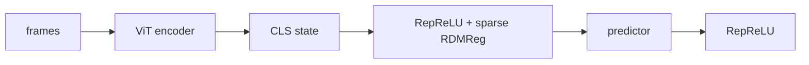
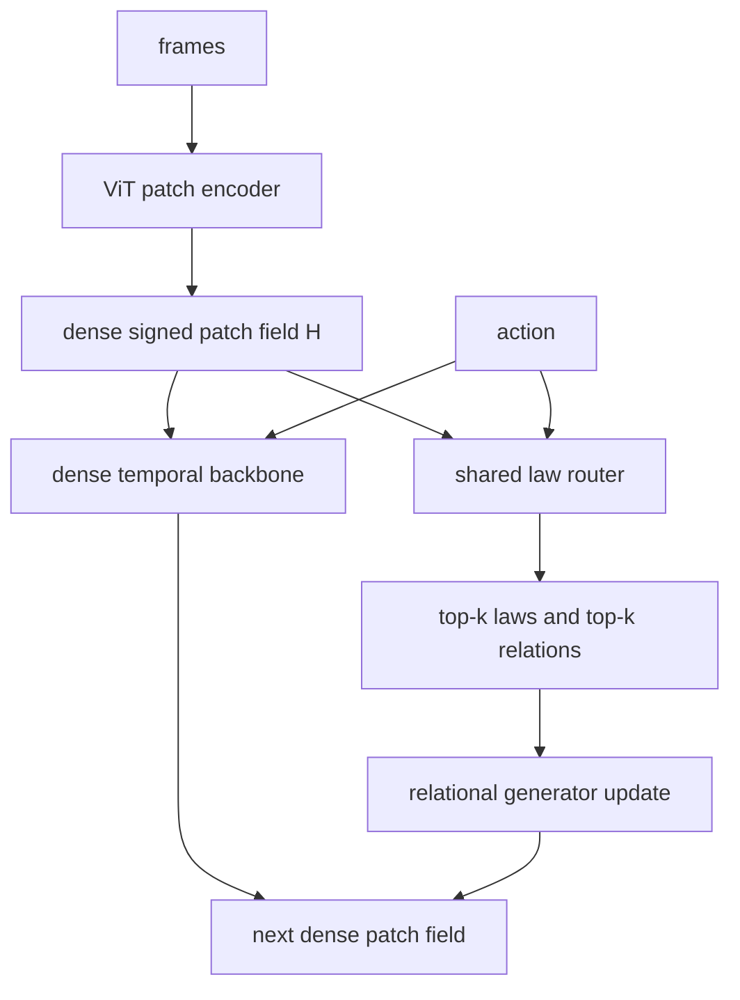

# Dense state, sparse physical-law generator

This branch tests a narrower hypothesis than standard LpWM:

> Keep the visual state dense and signed. Put exact, controllable sparsity only on a
> bank of shared dynamics operators and their token-to-token relations.

There is no Slot Attention, object count, object mask, or object supervision. Objects
may emerge post hoc as persistent blocks or approximately invariant subspaces of the
learned interaction graph.

## Architecture

The original sparse arm applies the sparsifying link to the representation itself:



The new arm preserves all patch states and routes a sparse shared operator bank:



For target patch `p`, the default (`base_mode=identity`) update is

\[
\hat h_{p,t+1}=h_{p,t}+\sum_{m=1}^{M}g_{p,m,t}\,U_m
\left(\sum_q \alpha_{p,q,m,t}V_m h_{q,t}
+\sum_{\ell=1}^{H-1}R_{m,\ell}(h_{p,t}-h_{p,t-\ell})+C_ma_t\right).
\]

`U_m,V_m,R_m,C_m` are shared low-rank laws. The residual identity is fixed, so
there is no learned dense dynamics path that can absorb the task and bypass the
sparse generator. `base_mode=learned` restores such a VAR backbone only as an
explicit control. The law distribution `g` has exactly `law_topk` nonzero entries;
each relation distribution `alpha` has exactly `edge_topk` nonzero entries. The
straight-through estimator uses the sparse distribution on the forward pass and a
dense softmax derivative on the backward pass.

The relational predictor is patch-permutation equivariant:

\[
\Phi(\Pi H,a)=\Pi\Phi(H,a).
\]

This statement concerns the predictor. The ViT still supplies spatial position in
its token contents, which is useful geometry and is not an object-slot assignment.

## Implemented variants

| Hydra predictor | Purpose | Sparse quantity |
|---|---|---|
| `ltv` | Existing dense LTV control | none |
| `sparse_ltv` | Minimal intervention | low-rank LTV modes per patch/lag |
| `dense_generator` | Architecture-matched control | none (all laws/relations) |
| `sparse_generator` | Full hypothesis | shared laws and token relations |

For both sparse variants, use a patch encoder, `link=identity`, and `target_p=2`.
Using `link=reprelu` would make the state sparse again and would no longer isolate
the hypothesis.

## Controlling and identifying modes

Sparsity is explicit rather than induced by an L1 threshold:

- `law_topk / num_laws` is the exact active-law fraction;
- `edge_topk / num_patches` is the exact active-relation fraction;
- `gate_temperature` controls the soft gradient, not the forward support size;
- `gate_balance_weight` is optional and prevents complete law-bank starvation. Keep
  it at zero initially; physical laws need not be used uniformly.

Training logs expose:

- `generator_active_fraction`;
- `generator_edge_fraction`;
- `generator_usage_entropy`;
- `generator_switch_rate`.

`generator_switch_rate` is diagnostic only. Penalizing same-index patch switches
would incorrectly anchor a moving object to screen coordinates. A future temporal
penalty should first transport the support graph with a learned correspondence.

Set `predictor.record_graph=true` for analysis. `generator_graph()` then returns the
law and edge support of sample 0 at the final input time. Candidate emergent objects
can be measured as connected/spectral blocks of the time-averaged support graph;
they are not inserted into training.

## Colab screening run

The default screening configuration uses 64 patch tokens, latent width 192, eight
laws of rank 32, two active laws, eight incoming relations, and 256 RDMReg
projections. It is intentionally smaller than a paper-scale run.

```bash
export DATASET_DIR=/path/to/data
SMOKE=1 bash scripts/train_sparse_generator_colab.sh
bash scripts/train_sparse_generator_colab.sh

# dry-run first; RUN=1 executes the controlled variants
bash scripts/sweep_sparse_generator_colab.sh
RUN=1 SMOKE=1 bash scripts/sweep_sparse_generator_colab.sh
```

The notebook [`notebooks/sparse_generator_colab.ipynb`](../notebooks/sparse_generator_colab.ipynb)
contains the same workflow. Start with the smoke run, then use successive halving:

1. one seed, 8 rollouts, one epoch;
2. one seed, 50 rollouts, two epochs;
3. three seeds only for the best two variants;
4. planning evaluation only after one-step and open-loop validation improve.

A useful controlled comparison keeps encoder, dense state, data, and optimizer fixed:

| Arm | Predictor | Question |
|---|---|---|
| dense control | `ltv` | Does routing help at all? |
| minimal | `sparse_ltv` | Is sparse mode selection sufficient? |
| matched relational | `dense_generator` | Does sparsity help with architecture fixed? |
| relational | `sparse_generator` | Do sparse shared relations improve dynamics/planning? |

Run the tests with `python -m pytest tests/test_sparse_generator.py`.
